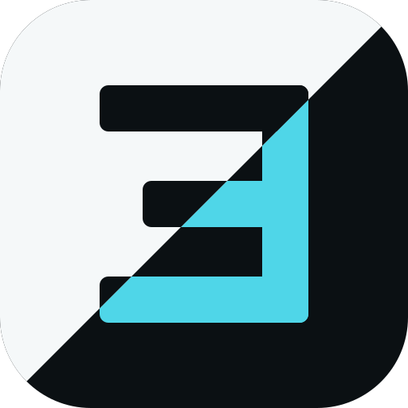
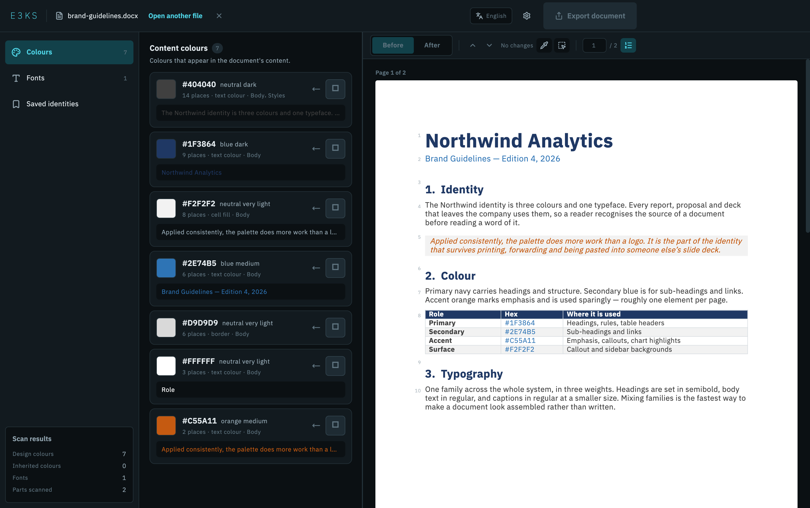
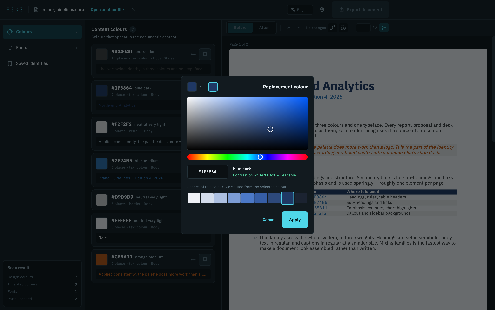
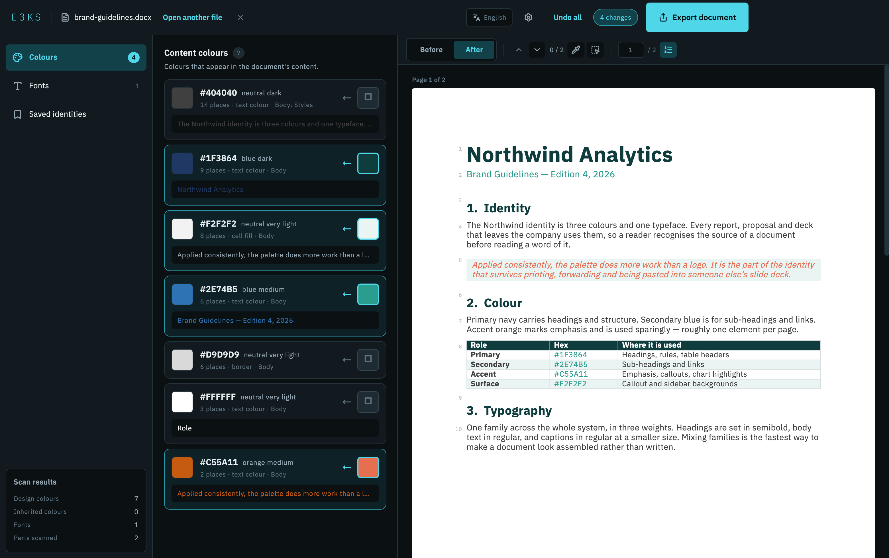

<p align="center">
  
</p>

<h1 align="center">E3KS</h1>

<p align="center">Swap the colours and fonts of Word and PowerPoint documents.</p>

<p align="center">
  
  
  
  
  
</p>



## What it is

A company changes its brand colours. The Word and PowerPoint files it already
has still carry the old ones, spread across body text, headings, tables,
headers and footers, and the document theme.

E3KS opens the file, lists every colour and font inside it, takes a
replacement for each, shows the result page by page, and writes a new file.

## Features

- **Colour list** — each colour with its occurrence count, what it is used for
  and a sample of its text. Colours that came from an Office template sit in
  their own list.
- **Preview** — pages at their real size, with a before/after toggle.
- **Eyedropper** — point at a colour on the page to select it. The app follows
  it through the document and offers computed shades of it.
- **Fonts** — Latin and Arabic are set separately. Monospaced fonts stay as
  they are. Fonts missing from the machine are fetched from Google Fonts and
  cached.
- **Identities** — save a palette and apply it to any document, or lift one
  from another open file.
- **Two languages** — Arabic and English, with the layout direction following
  the language.

## Screenshots

**Choosing a replacement colour**



**After applying a new palette**



The document in the screenshots is [`docs/demo/brand-guidelines.docx`](docs/demo/brand-guidelines.docx).

## Output

Parts of the file that were left alone are copied byte for byte. Before
anything is written, the output is checked: XML parses, fields are balanced,
part counts match, relationships resolve, and the finished archive re-opens.
A failed check means no file is produced. Writes go to a temporary file and
are renamed into place, and the source is opened read-only.

## Formats

| Format | Status |
|---|---|
| `.docx` | Supported |
| `.pptx`, `.ppsx`, `.potx` | Supported |
| `.pdf` | Research. Colours look feasible; fonts do not. |

Files are identified by content type, so a renamed file is handled as what it
actually is.

## Built with

| | |
|---|---|
| Engine | Dart 3.9, pure — `archive` and `xml` |
| UI | Flutter 3.47 on macOS |
| Files | `file_selector`, `desktop_drop` |
| Icons | `lucide_icons_flutter` |
| Localisation | `flutter_localizations`, `intl`, ARB |
| State | `ChangeNotifier` |
| Typeface | IBM Plex Sans Arabic, bundled |

## Layout

```
packages/e3ks_engine/     Engine: inspect, transform, preview, validate
  lib/src/format/         Everything specific to a file format
apps/e3ks_desktop/        Flutter UI
tools/e3ks_cli/           Command line over the engine
docs/adr/                 Architecture decisions
brand/                    The mark and its usage
```

## Running

```bash
# Engine
cd packages/e3ks_engine && dart pub get && dart test

# App
cd apps/e3ks_desktop && flutter pub get && flutter run -d macos

# Release build, icon generated from brand/
./brand/build-appicon.sh
cd apps/e3ks_desktop && flutter build macos --release
```

71 engine tests and 85 app tests. Documentation and project rules are in
Arabic; code is in English.

## Licence

```
E3KS
Copyright (C) 2026  m7md-d
```

Free software under the **GNU General Public License, version 3** or any later
version, as published by the Free Software Foundation. Distributed in the hope
that it will be useful, but **with no warranty** — without even the implied
warranty of merchantability or fitness for a particular purpose. Full text in
[`LICENSE`](LICENSE).

### Third party

| | Licence |
|---|---|
| **IBM Plex Sans Arabic** — bundled UI typeface | SIL Open Font License 1.1, text in [`apps/e3ks_desktop/assets/fonts/OFL.txt`](apps/e3ks_desktop/assets/fonts/OFL.txt) |
| **Lucide** — UI icons | ISC |
| Dart and Flutter packages | Listed in the app under Settings → Licences |

Fonts fetched from Google Fonts stay under their own licences and are stored
on the user's machine only.
